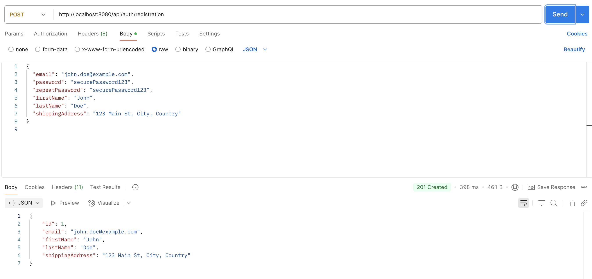
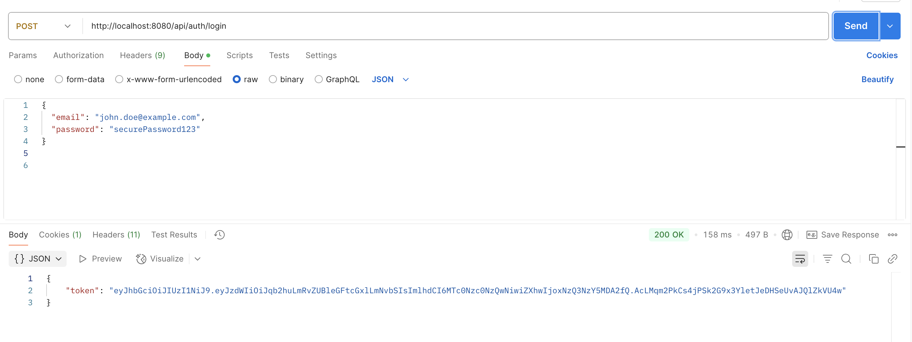
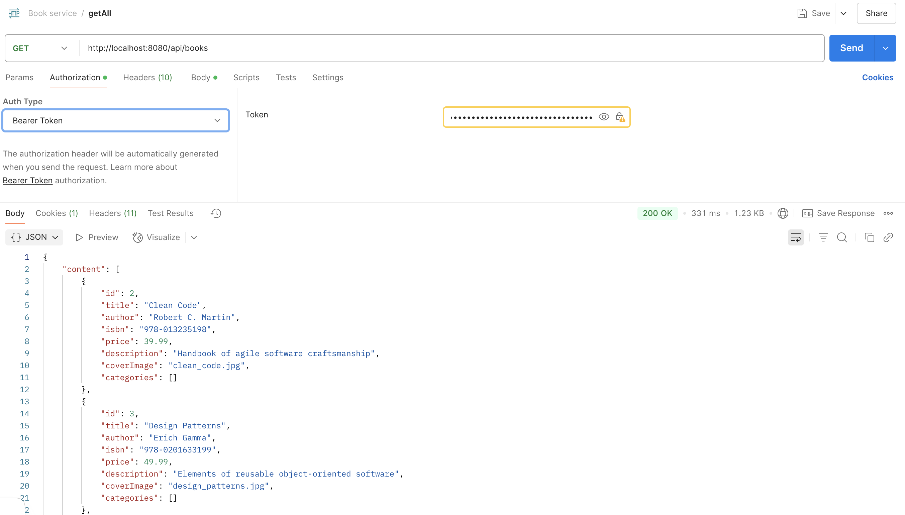

# 📚 Bookstore API

An online bookstore RESTful API built with **Spring Boot** following **clean code principles**. 
The application handles **user authentication**, **book catalog**, **shopping cart**, and **order management**, with role-based access.

> 🔐 All sensitive operations (like managing books/orders) are restricted to `ROLE_ADMIN`.

---

## 🚀 Motivation

Modern online bookstores must provide flexible browsing, secure ordering, and a great developer experience.  
This project simulates a real-world e-commerce system, where admin users manage the catalog and regular users browse, add books to their cart, and place orders.

---

## 🛠️ Technologies & Tools

| Layer                  | Tech Stack                     |
|------------------------|--------------------------------|
| **Language**           | Java 21                        |
| **Framework**          | Spring Boot                    |
| **Security**           | Spring Security + JWT          |
| **Data Access**        | Spring Data JPA + Hibernate    |
| **Database**           | MySQL (configurable)           |
| **API Documentation**  | Swagger (Springdoc OpenAPI)    |
| **Validation**         | Spring Validation              |
| **Testing**            | JUnit, Mockito                 |
| **Dev Tools**          | Lombok, MapStruct              |
| **Auth**               | JWT Token-based authentication |

---

## ▶️ How to Run the Project

```bash
# 1. Clone the repository
git clone https://github.com/smagles/book-app

# 2. Configure application.properties or application.yml
# - Set DB credentials
# - Set JWT secret, expiration

# 3. Build the project
./mvnw clean install

# 4. Run the app
./mvnw spring-boot:run

```
## 🔍 API Documentation: Swagger UI (for testing): http://localhost:8080/swagger-ui/index.html

## 🧪 Testing the API with Postman

Once the application is running at `http://localhost:8080`, you can interact with the endpoints using **Postman**.

### 🟢 Step 1: Register a New User

1. Open **Postman**
2. Create a new **POST** request to:
   `http://localhost:8080/api/auth/register`
4. In the **Body**, choose `raw` and set the format to `JSON`, then paste the following example:

```json
{
  "email": "john.doe@example.com",
  "password": "securePassword123",
  "repeatPassword": "securePassword123",
  "firstName": "John",
  "lastName": "Doe",
  "shippingAddress": "123 Main St, City, Country"
}
```


5. Click **Send**:
   If successful, you'll receive a 201 Created response with the user data.

### 🔐 Step 2: Log In to Get JWT Token

1. Open **Postman**
2. Create a new **POST** request to:
   `http://localhost:8080/api/auth/login`
4. In the **Body**, choose `raw` and set the format to `JSON`, then paste the following example:

```json
{
  "email": "john.doe@example.com",
  "password": "securePassword123"
}

```


5. Click **Send**:
If the credentials are correct, you will receive a 200 OK response with a JSON Web Token:
📌 Copy this token — you'll need it for authorized requests in the next steps.

### 📚 Step 3: Get All Books from the Catalog (Authorized)

1. Open **Postman**
2. Create a new **GET** request to:
   `http://localhost:8080/api/books`
3. Go to the **Authorization** tab:
    - Type: `Bearer Token`
    - Paste the token received from the login response into the **Token** field

4. Click **Send**

If the token is valid, you’ll receive a **200 OK** response with a paginated list of books:



---
## ✨ Key Features

### 🔐 Authentication Controller
| Method | Endpoint                 | Description                | Access |
| ------ | ------------------------ | -------------------------- | ------ |
| `POST` | `/api/auth/login`        | Authenticate and get token | Public |
| `POST` | `/api/auth/registration` | Register a new user        | Public |


### 📚 Book Controller
| Method   | Endpoint            | Description                                | Access        |
| -------- | ------------------- | ------------------------------------------ |---------------|
| `GET`    | `/api/books`        | View all books with pagination and sorting | Authenticated |
| `GET`    | `/api/books/{id}`   | Retrieve a book by ID                      | Authenticated |
| `POST`   | `/api/books`        | Create a book                              | Admin only    |
| `PUT`    | `/api/books/{id}`   | Update a book                              | Admin only    |
| `DELETE` | `/api/books/{id}`   | Delete a book                              | Admin only    |
| `GET`    | `/api/books/search` | Search books by title, author, etc.        | Authenticated |


### 🛒 Shopping Cart
| Method   | Endpoint                       | Description                    | Access        |
| -------- | ------------------------------ | ------------------------------ | ------------- |
| `GET`    | `/api/cart`                    | Get the current user’s cart    | Authenticated |
| `POST`   | `/api/cart`                    | Add a book to cart             | Authenticated |
| `PUT`    | `/api/cart-items/{cartItemId}` | Update quantity of a cart item | Authenticated |
| `DELETE` | `/api/cart-items/{cartItemId}` | Remove a cart item             | Authenticated |


### 📦 Orders
| Method  | Endpoint                           | Description                         | Access        |
| ------- | ---------------------------------- | ----------------------------------- | ------------- |
| `GET`   | `/api/orders`                      | Get all orders for the current user | Authenticated |
| `POST`  | `/api/orders`                      | Create a new order from cart        | Authenticated |
| `PATCH` | `/api/orders/{id}`                 | Update order status                 | Admin only    |
| `GET`   | `/api/orders/{orderId}/items`      | Get items of an order               | Authenticated |
| `GET`   | `/api/orders/{orderId}/items/{id}` | Get a specific order item           | Authenticated |

### 🗂️ Category Controller
| Method   | Endpoint                     | Description                    | Access        |
| -------- | ---------------------------- | ------------------------------ |---------------|
| `POST`   | `/api/categories`            | Create a category              | Admin only    |
| `GET`    | `/api/categories`            | Get all categories (paginated) | Authenticated |
| `GET`    | `/api/categories/{id}`       | Get a category by ID           | Authenticated |
| `PUT`    | `/api/categories/{id}`       | Update a category              | Admin only    |
| `DELETE` | `/api/categories/{id}`       | Delete a category              | Admin only    |
| `GET`    | `/api/categories/{id}/books` | Get all books by category      | Authenticated |
